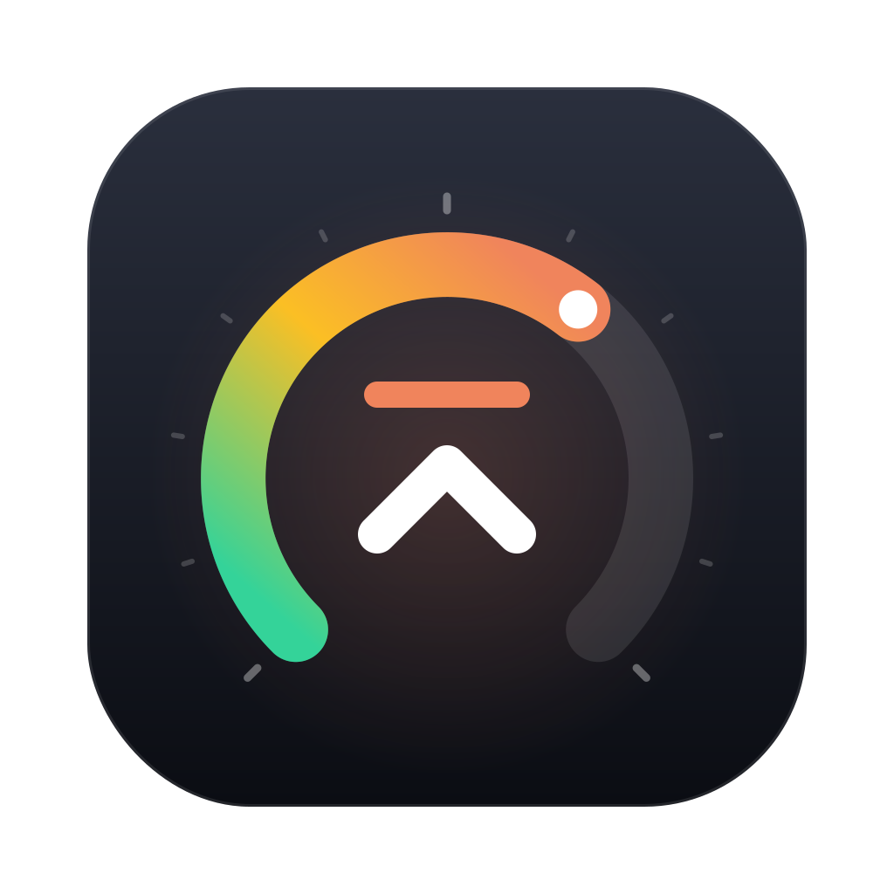

# Headroom



**Know how much Claude and Codex you have left, before you hit the wall.**

A native macOS menu bar app that shows your subscription usage limits for **Claude** (shared by claude.ai and Claude Code) and **Codex** (ChatGPT plan limits for Codex CLI, IDE and cloud), and notifies you before you hit them.

- **Current session / 5h limit**: % used, % left, time until reset
- **Weekly limit**: % used, % left, time until reset
- Model-specific limits (Claude Opus / Sonnet weekly, extra Codex model limits) when your plan reports them
- Menu bar ring icon (outer ring = session, inner ring = weekly), with an optional `59%` label
- **Combined** menu bar icon (default): one icon showing whichever service is closest to its limit, with both services in one popover. Or **Separate**: one icon per service (Settings → Menu bar → Icons)
- macOS notifications at thresholds you set (default 75% and 90%), once per threshold per window, naming the service ("Codex weekly usage at 90%")
- Turn each service on or off, configurable refresh interval, launch at login

Requires macOS 13+ and at least one of:

- **Claude**: a Pro or Max plan, with Claude Code signed in (`claude` → `/login`)
- **Codex**: a ChatGPT plan that includes Codex (Plus, Pro, Business, …), with Codex CLI signed in with ChatGPT (`codex login`)

> **ChatGPT chat message limits are not shown.** Codex's usage endpoint doesn't report them and there is no known endpoint that does, so the Codex numbers cover Codex usage only, not messages in the ChatGPT app.

## Download

**[⬇ Download the latest Headroom.zip](https://github.com/jengguru/claude-usage-menubar/releases/latest/download/Headroom.zip)** · [all releases](https://github.com/jengguru/claude-usage-menubar/releases)

1. Unzip the file and move **Headroom.app** to **Applications**.
2. Headroom isn't notarized by Apple, so the first launch is blocked. Right-click the app → **Open** → **Open**. On macOS 15 or later, open it once, then go to **System Settings → Privacy & Security** and click **Open Anyway**.
3. Headroom appears in the menu bar. Click it, then the gear icon, to choose services and the menu bar style.

Each release is built by GitHub Actions from a tagged commit on `main`, never on someone's laptop. [SECURITY.md](SECURITY.md) explains how to check that the file you downloaded is that build.

## Where the data comes from

### Claude

I compared four possible sources before building:

| Source | What it gives | Reliability |
| --- | --- | --- |
| **`GET https://api.anthropic.com/api/oauth/usage`** (used here) | `five_hour` / `seven_day` (+ `seven_day_opus`, `seven_day_sonnet`) `utilization` % and `resets_at` | The same data Claude Code's `/usage` command and claude.ai's usage page show. Authoritative, but **undocumented**, so it may change without notice. It rate-limits aggressive polling (HTTP 429). |
| Claude Code status line JSON (`rate_limits.five_hour.used_percentage`) | Same numbers | Available only inside a running Claude Code session, and only after its first API response. Good for a status line, not for a standalone app. |
| Local transcripts (`~/.claude/projects/**/*.jsonl`, e.g. `ccusage`) | Token counts for Claude Code on this Mac | Can't produce a limit %: Anthropic doesn't publish plan limits in tokens, and usage from claude.ai, the mobile apps and other machines doesn't appear. |
| claude.ai web API with a browser `sessionKey` cookie | Same numbers | Needs you to copy a browser cookie that expires. Fragile, and it looks like scraping. |

**Chosen:** the OAuth usage endpoint, authenticated with Claude Code's own OAuth token:

- **Token:** read from the macOS Keychain item `Claude Code-credentials` (via `/usr/bin/security`). If that item doesn't exist, the app falls back to `~/.claude/.credentials.json` (or `$CLAUDE_CONFIG_DIR/.credentials.json`). The first time, macOS asks whether `security` may read the item. Click **Always Allow**.
- **Request:** `Authorization: Bearer <accessToken>` and `anthropic-beta: oauth-2025-04-20`.
- **Read-only:** the app **never refreshes or writes the token**. Refreshing would rotate Claude Code's refresh token and could sign Claude Code out. When the access token expires, the app shows a message. As soon as you use Claude Code again, it refreshes the token and the app picks it up automatically.
- **Polling:** every 5 minutes by default (2–30 is configurable). On a 429 the app backs off (it honours `Retry-After`, waits at least 2 minutes and at most 1 hour). The Refresh button respects the backoff.
- **Privacy:** the only Claude request goes to `api.anthropic.com`. The token stays in memory for the length of each request.

### Codex

**Chosen:** `GET https://chatgpt.com/backend-api/wham/usage`, the endpoint Codex CLI's `/status` command reads (checked against the [openai/codex](https://github.com/openai/codex) source, `codex-rs/backend-client`). It returns:

```json
{"plan_type": "plus",
 "rate_limit": {"allowed": true, "limit_reached": false,
   "primary_window":   {"used_percent": 42, "limit_window_seconds": 18000,  "reset_after_seconds": 3600,   "reset_at": 1790083980},
   "secondary_window": {"used_percent": 81, "limit_window_seconds": 604800, "reset_after_seconds": 400000, "reset_at": 1790480380}},
 "additional_rate_limits": [{"limit_name": "…", "metered_feature": "…", "rate_limit": {…}}]}
```

Windows are labelled the way Codex's `/status` labels them (`5h`, `weekly`, …, from `limit_window_seconds`). Windows up to a day long use your *session* thresholds; longer ones use your *weekly* thresholds.

- **Token:** read from `~/.codex/auth.json` (or `$CODEX_HOME/auth.json`): `tokens.access_token`, plus `tokens.account_id`, which is sent as `ChatGPT-Account-Id` like Codex does. If there's no file and Codex is set to keep credentials in the Keychain (`cli_auth_credentials_store = "keyring"`), the app reads the `Codex Auth` Keychain item via `/usr/bin/security` instead, and macOS asks once.
- **Request:** `Authorization: Bearer <access_token>`, `ChatGPT-Account-Id: <account_id>`.
- **Read-only:** like the Claude side, the app **never refreshes or writes** Codex's tokens (a refresh would rotate Codex's refresh token and could sign Codex out). When the token expires, using Codex once refreshes it and the app picks it up.
- **API-key logins** (`OPENAI_API_KEY` in auth.json) have no plan limits, so the app asks you to sign in with ChatGPT instead.
- **Polling and privacy:** same schedule and 429 backoff as Claude. The only Codex request goes to `chatgpt.com`, and only when a Codex sign-in exists. Error messages name JSON keys, never token values.

## Architecture

```
Sources/
  HeadroomCore/             Foundation only, unit tested
    UsageModels.swift       UsageProvider, UsageWindow / UsageSnapshot (shared by all providers)
    UsageFetching.swift     UsageFetcher protocol, shared HTTP status → error mapping
    Credentials.swift       file / Keychain (security CLI) sources + first-match loader
    Providers/Claude.swift  Claude Code credentials, /api/oauth/usage client + decoder
    Providers/Codex.swift   Codex auth.json credentials, /wham/usage client + decoder
    Thresholds.swift        once-per-window threshold alerts (hysteresis + reset detection)
    UsageFormatting.swift   "3h 27m", "Today at 16:00", % and colour levels
  Headroom/                 SwiftUI MenuBarExtra app (LSUIElement, no Dock icon)
    HeadroomApp.swift       MenuBarExtra scenes: one combined, or one per provider
    UsageStore.swift        per-provider @MainActor poll loop, backoff, error states
    PopoverView.swift       the popover UI
    SettingsPanel.swift     in-popover settings
    MenuBarIcon.swift       ring icon drawing + labels
    NotificationManager.swift  UNUserNotificationCenter
Tests/HeadroomCoreTests     decoding, credentials, thresholds, provider selection, formatting
Resources/AppIcon.svg       icon source (AppIcon.png is its 1024px render)
scripts/                    build-app.sh, smoke-test.sh, check-no-dependencies.sh
.github/workflows/          build.yml (every push), release.yml (v* tags)
```

Adding a provider means writing a `UsageFetcher` that returns a `UsageSnapshot`; thresholds, notifications, the menu bar and the popover work from the snapshot.

The combined icon shows the provider whose highest *primary* window (session or weekly) is highest. Model-specific windows don't count, because hitting one still leaves the other models available. On a tie it keeps the first provider (Claude), so the icon doesn't flicker. With more than one service turned on, the label names the service (`Codex 81%`). In separate mode each icon always shows its service's name, because the rings look the same for every service.

How threshold notifications work: each threshold fires once per usage window, tracked separately per service. It re-arms when the window's `resets_at` moves (a new window starts), or when usage drops more than 5 points below the threshold. If a single poll crosses several thresholds, you get one notification for the highest. Fired state is saved, so relaunching the app doesn't repeat alerts.

## Build & run

Needs Xcode 15+ (or its command line tools). Run the core unit tests, build `build/Headroom.app` (ad-hoc signed, with icon) and open it:

```sh
swift test
scripts/build-app.sh
open "build/Headroom.app"
```

Move the app to `/Applications` if you want **Launch at login**. CI (GitHub Actions, `macos-14`) runs the tests, builds a universal app with the hardened runtime, checks that it launches, and uploads `Headroom.zip` as a workflow artifact on every push.

### Publishing a release

Bump `CFBundleShortVersionString` in `Resources/Info.plist`, merge to `main`, then tag that commit on `main`:

```sh
git checkout main
git pull
git tag v0.3.0
git push origin v0.3.0
```

The **Release** workflow checks that the tag is on `main` and matches `Info.plist`, runs the tests, builds the app and publishes a GitHub Release with `Headroom.zip` and its SHA-256. The Download link above always points at the newest release.

## Troubleshooting

- **"No Claude Code sign-in found"**: install Claude Code, run `claude`, then `/login` with your Pro/Max account.
- **"No Codex sign-in found"**: install Codex CLI and run `codex login` with your ChatGPT account. If you don't use one of the services, turn it off in Settings → Services.
- **"Codex is signed in with an API key"**: API-key usage has no plan limits. Run `codex login` and choose **Sign in with ChatGPT**.
- **`CODEX_HOME` / `CLAUDE_CONFIG_DIR` ignored**: apps opened from Finder don't see variables set in your shell profile. Use the default `~/.codex` / `~/.claude`, or start the app's binary from a Terminal that has them set: `build/Headroom.app/Contents/MacOS/Headroom`.
- **"Keychain access was denied"**: press Refresh and choose **Always Allow** in the prompt.
- **"sign-in token expired"**: use Claude Code or Codex once (any prompt) and it refreshes its token.
- **"Rate limited"**: the endpoint throttles frequent callers. The app retries automatically. Consider a longer refresh interval.

## Limitations / next steps

- Both endpoints are unofficial. If Anthropic or OpenAI changes one, parsing fails with a visible error instead of showing wrong numbers.
- **ChatGPT chat/message limits are not available**, only Codex limits.
- API-key usage (Anthropic Console, OpenAI API keys) is not covered: those accounts have no subscription windows.
- Ideas: a "limit reset" notification, a usage history sparkline, a status line bridge as a second data source.

Not affiliated with or endorsed by Anthropic or OpenAI.
